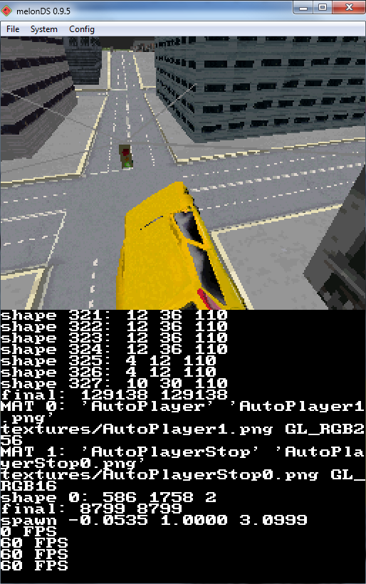

# FFX Runner DS

Recreation / de-make of the web browser game [FFX Runner](https://github.com/OfficinePixel/ffx_runner) to the Nintendo DS
Made using [BlocksDS](https://blocksds.skylyrac.net/)

Still W.I.P.

## Third party libraries
* [Box3D](https://github.com/erincatto/box3d)
  * TO-DO: Try to optimize with a fixed-point math version like Box2D
* [tinyobjloader](https://github.com/tinyobjloader/tinyobjloader)
* [stb_image](https://github.com/nothings/stb)
* [dr_wav](https://github.com/mackron/dr_libs)
